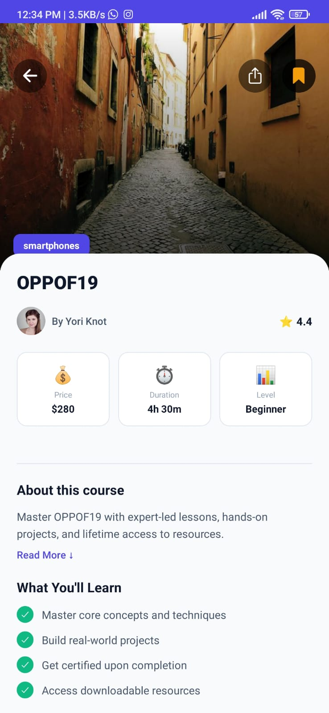
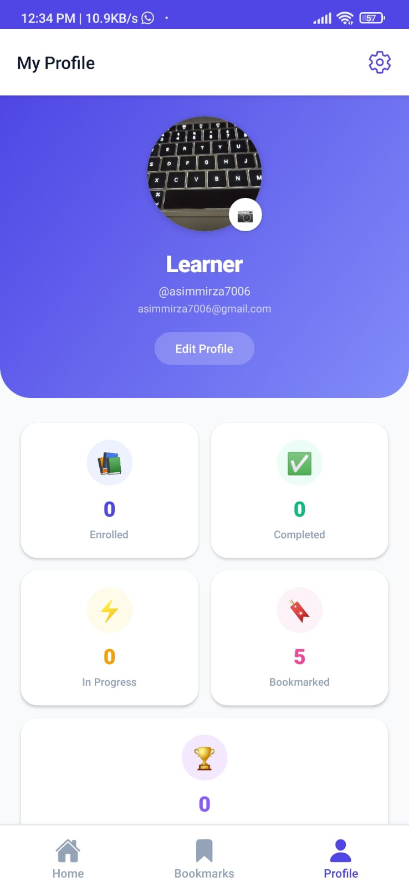
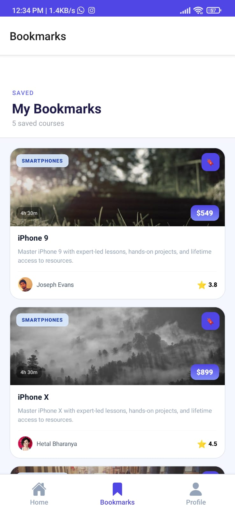

# Mini LMS — React Native Expo

A production-ready mobile Learning Management System built with React Native Expo SDK 55, TypeScript, and Expo Router. Demonstrates native features, WebView integration, secure authentication, and real-world state management.

---

## Screenshots

<table>
  <tr>
    <td align="center"><b>Login</b></td>
    <td align="center"><b>Register</b></td>
    <td align="center"><b>Course Detail</b></td>
  </tr>
  <tr>
    <td></td>
    <td></td>
    <td></td>
  </tr>
  <tr>
    <td align="center"><b>Bookmarks</b></td>
    <td align="center"><b>Profile</b></td>
    <td align="center"><b>Home</b></td>
  </tr>
  <tr>
    <td></td>
    <td></td>
    <td></td>
  </tr>
</table>

---

## Tech Stack

| Layer | Technology |
|-------|-----------|
| Framework | React Native + Expo SDK 55 |
| Language | TypeScript (strict) |
| Navigation | Expo Router v4 (file-based) |
| State | Zustand v5 |
| Styling | NativeWind v4 (Tailwind) |
| Auth storage | Expo SecureStore |
| App storage | AsyncStorage |
| HTTP client | Axios (interceptors + retry) |
| Forms | React Hook Form + Zod |
| Notifications | expo-notifications SDK 55 |
| WebView | react-native-webview 13.16 |
| Security | jail-monkey + custom security manager |

---

## Features

### Part 1 — Authentication
- Login and register via `/api/v1/users` endpoints
- Tokens stored securely in Expo SecureStore
- Auto-login on restart with JWT validation
- Automatic token refresh on expiry
- Logout with server-side session invalidation

### Part 2 — Course Catalog
- Courses built from `randomproducts` (course data) + `randomusers` (instructors)
- Pull-to-refresh and paginated loading
- Search and filter by title/category
- Bookmark toggle with AsyncStorage persistence
- Enroll/unenroll with animated feedback

### Part 3 — WebView Integration
- Embedded course content viewer with local HTML template
- Native → WebView communication via `injectJavaScript` (passes auth token, username, session expiry)
- WebView → Native messaging (lesson tap events, completion alerts)
- Full error handling: offline detection, HTTP errors, retry button

### Part 4 — Native Features
- Notification permission request on first launch
- Immediate notification when user bookmarks 5+ courses
- 24-hour inactivity reminder (scheduled on app background, cancelled on foreground)
- Offline banner via NetInfo with animated slide-in

### Part 5 — State Management
- Auth state: Zustand `authStore` + React Context
- Course + bookmark + enroll state: Zustand `courseStore`
- User preferences (notification toggles): Zustand `preferencesStore`
- Profile data (picture, bio): AsyncStorage

### Part 6 — Error Handling
- Axios interceptor: automatic token refresh on 401
- Exponential backoff retry (3 attempts, 1s/2s/4s delays)
- 10-second request timeout
- Offline mode banner
- WebView error recovery UI

### Bonus
- Jailbreak/root detection (`jail-monkey` + `react-native-root-detection`)
- Security block screen for compromised devices (production only)
- Certificate pinning utility (`utils/certificatePinning.ts`)
- AES encryption layer for sensitive local data (`utils/encryption.ts`)
- Preference-gated notifications (users can toggle per notification type)

---

## Project Structure

```
mini-lms/
├── app/
│   ├── _layout.tsx          # Root layout — providers, auth guard, notifications init
│   ├── index.tsx            # Entry redirect (auth check)
│   ├── (auth)/
│   │   ├── _layout.tsx
│   │   ├── login.tsx
│   │   └── register.tsx
│   ├── (tabs)/
│   │   ├── _layout.tsx      # Tab bar config
│   │   ├── index.tsx        # Home — course list, search, pull-to-refresh
│   │   ├── bookmarks.tsx    # Saved courses
│   │   └── profile.tsx      # User profile + picture update
│   └── course/
│       ├── [id].tsx         # Course detail — enroll, bookmark, share
│       └── webview.tsx      # Embedded course content viewer
├── components/
│   ├── CourseCard.tsx       # Memoized course card with animations
│   ├── OfflineBanner.tsx    # NetInfo-driven offline indicator
│   ├── ProtectedRoute.tsx   # Auth guard wrapper
│   └── SecurityBlockScreen.tsx
├── context/
│   └── AuthContext.tsx      # Auth state + checkAuth + logout
├── services/
│   ├── api.ts               # Axios instance — interceptors, retry, backoff
│   ├── auth.service.ts      # Login, register, token management
│   └── courses.service.ts   # Fetch + build course list
├── store/
│   ├── authStore.tsx        # Zustand auth slice
│   ├── courseStore.tsx      # Courses, bookmarks, enrolled
│   └── preferencesStore.ts  # Notification preferences
├── utils/
│   ├── Config.ts            # Env variable access
│   ├── notifications.ts     # All notification logic
│   ├── security.ts          # Jailbreak/root detection
│   ├── storage.ts           # SecureStore wrapper
│   ├── encryption.ts        # AES encryption helpers
│   ├── certificatePinning.ts
│   └── jwt.ts
└── types/
    └── index.ts
```

---

## Environment Variables

Create a `.env` file in the project root:

```env
EXPO_PUBLIC_APP_ENV=development
EXPO_PUBLIC_API_BASE_URL=https://api.freeapi.app
ENCRYPTION_SECRET=your_encryption_secret_here
JWT_SECRET=your_jwt_secret_here
CERT_PIN_HASH_PRIMARY=your_cert_pin_hash_here
CERT_PIN_HASH_BACKUP=your_backup_cert_pin_hash_here
```

> `EXPO_PUBLIC_` prefix exposes variables to the client bundle. Never put real secrets under `EXPO_PUBLIC_`.

---

## Setup & Installation

### Prerequisites

- Node.js 18+
- npm
- For iOS builds: macOS + Xcode 15+
- For Android builds: Android Studio + JDK 17

### Steps

```bash
# 1. Clone the repository
git clone https://github.com/AsimSumair/MINI-LMS.git
cd mini-lms

# 2. Install dependencies
npm install

# 3. Create environment file
cp .env.example .env
# Edit .env and fill in your values

# 4. Start the development server
npm start
```

### Running on a device

```bash
# Android
npm run android

# iOS
npm run ios
```

> **Important:** Push notifications require a **physical device** and a development/production build. They do not work in Expo Go or simulators.

---

## Building the APK (Android)

```bash
# Install EAS CLI
npm install -g eas-cli

# Login to Expo account
eas login

# Development build APK
eas build --platform android --profile development

# Production APK
eas build --platform android --profile production
```

The APK download link appears in your Expo dashboard at [expo.dev](https://expo.dev) once the build completes (EAS project ID: `9b7c2627-08d7-4aaa-8d02-216563376821`).

---

## API Reference

Base URL: `https://api.freeapi.app`

| Endpoint | Method | Description |
|----------|--------|-------------|
| `/api/v1/users/register` | POST | Register new user |
| `/api/v1/users/login` | POST | Login — returns access + refresh tokens |
| `/api/v1/users/logout` | POST | Invalidate session |
| `/api/v1/users/refresh-token` | POST | Get new access token |
| `/api/v1/users/current-user` | GET | Get authenticated user profile |
| `/api/v1/public/randomproducts` | GET | Course data (paginated) |
| `/api/v1/public/randomusers` | GET | Instructor data (paginated) |

---

## Architectural Decisions

**Expo Router (file-based navigation)** — chosen for built-in deep linking, typed routes, and clean layout nesting. Auth guard lives at root layout level rather than per-screen.

**Zustand over Redux** — lightweight, no boilerplate, works naturally with SecureStore via async actions. Three slices keep concerns separated: auth, courses, preferences.

**Two-token auth pattern** — short-lived access token + refresh token, both in SecureStore. The Axios interceptor auto-refreshes on 401 transparently.

**Parallel API fetch + merge** — `randomproducts` and `randomusers` fetched in parallel, merged by index in `buildCourses()`. Picsum seeded images give each category a consistent visual identity.

**Notification preference gating** — `notifications.ts` reads from `preferencesStore.getState()` (Zustand's outside-component accessor) before scheduling anything, so user toggle preferences are respected without app restart.

**Security in production only** — `securityManager.blockIfCompromised()` is skipped when `Config.isDev` is true, preventing jailbreak detection from blocking simulator development.

---

## Known Issues / Limitations

- Notifications require a physical device and a development/production build — not supported in Expo Go or simulators
- Course progress percentage (42%) is a static placeholder — the free API has no progress tracking endpoint
- Certificate pinning is implemented as a utility but not enforced at the Axios layer — full enforcement requires a custom native module
- `bookmarks.tsx` uses `FlatList`; `@legendapp/list` is installed and should be used in `app/(tabs)/index.tsx` for the main course list
- Portrait orientation only (set in `app.json`)

---


## Author

Built as a React Native developer assignment.  
API: [freeapi.app](https://api.freeapi.app) · Expo project owner: `asimmirza`